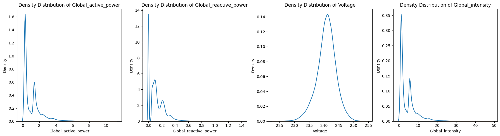
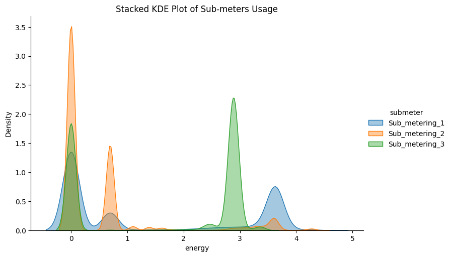
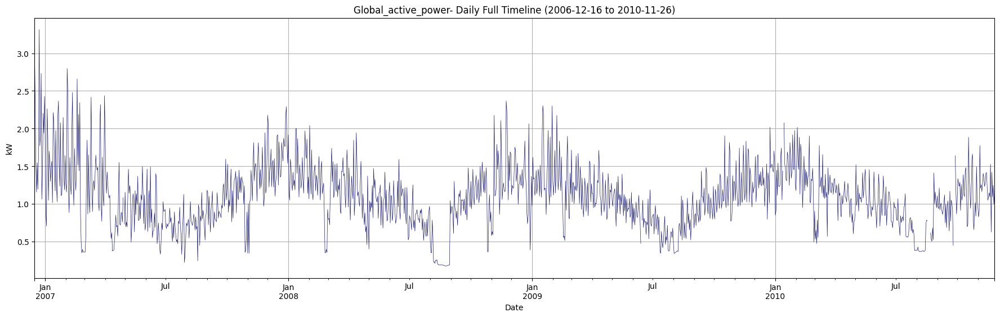
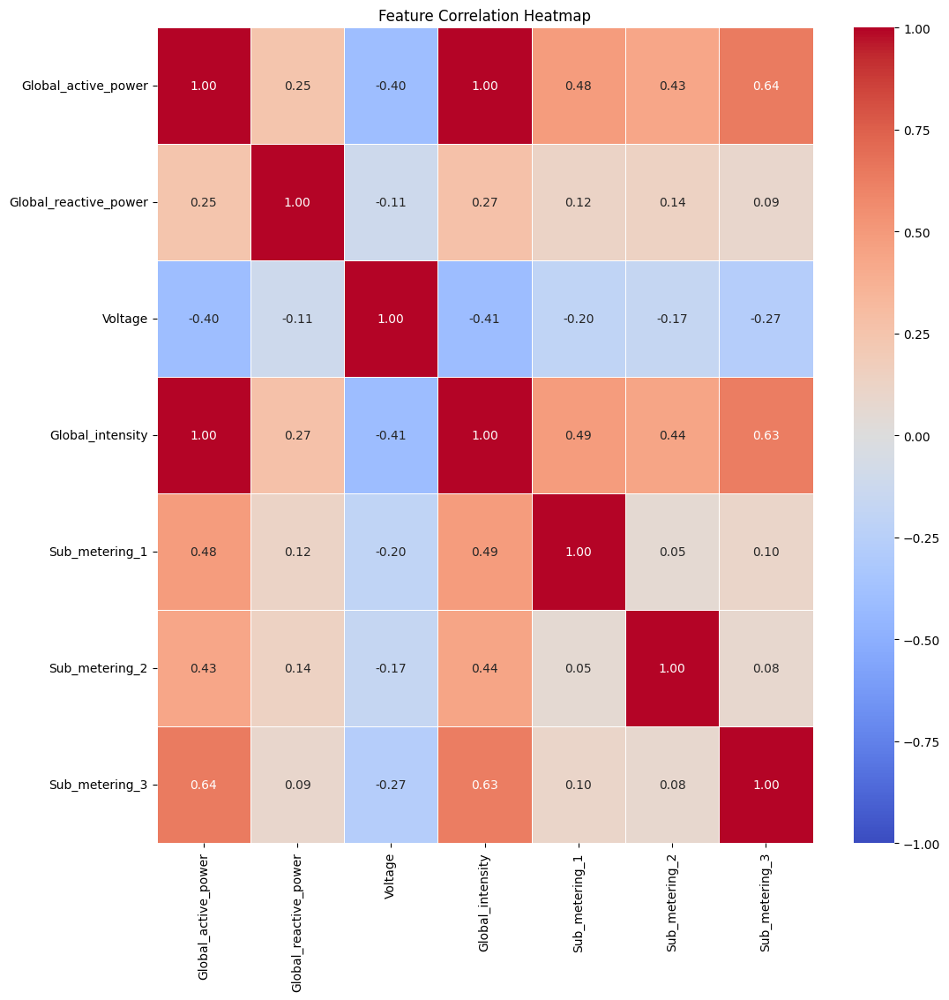
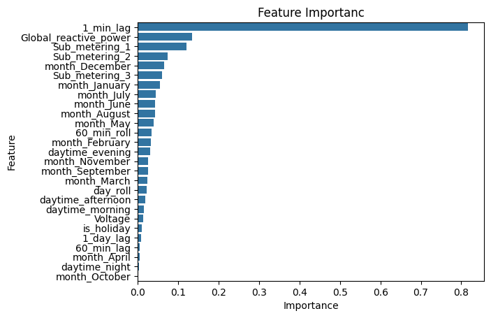
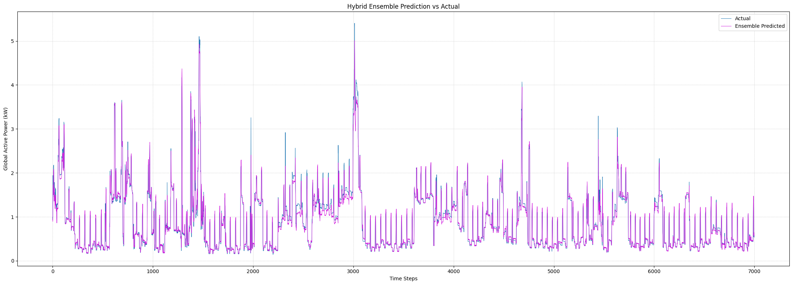
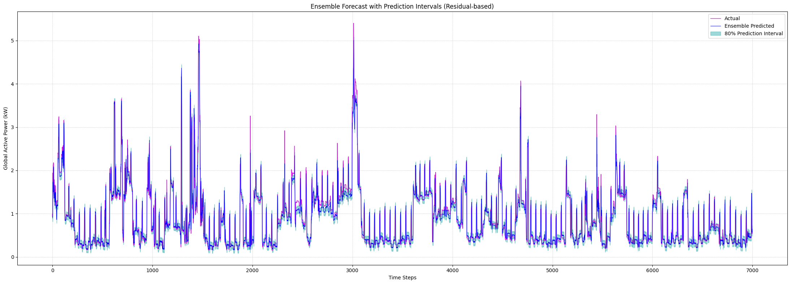

# Energy Consumption Forcasting & Uncertainty Quantification

# Project Overview

This  project aims to develop highly robust and interpretable time series forecasting 
models for household energy consumption, addressing real -world 
complexities such as data anomalies seasonality and external inflence. 
In addition to generating accurate forcast models, the project also emphasize uncertainty interval for risk management and operational planning in the energy sector. 
## Dataset Information

- This archive contains 2075259 measurements gathered in a house located in Sceaux (7km of Paris, France)
- Between December 2006 and November 2010 (47 months). 


### Columns Overview

1. Date: in format dd/mm/yyyy
2. Time: in format hh:mm:ss
3. global_active_power: The total active power consumed by the household at a given minute, measured
in kilowatts (kW). Active power is the productive power that performs work in the electrical system.
4. global_reactive_power: The total reactive power, measured in kilovolt-amperes reactive (kVAR). Unlike
active power, reactive power does not perform work, instead oscillating between the source and load. It
is essential for maintaining the voltage levels necessary for equipment operation
5. voltage: The average voltage level observed during the minute, measured in volts (V).This measurement
is indicative of the quality and stability of the electricity supplied to the household.
6. global_intensity: This represents the total current consumed by the household, measured in amperes
(A). It provides a direct measure of how intense the usage of electricity is at any given time
7. sub_metering_1: energy sub-metering No. 1 (in watt-hour of active energy). It corresponds to the kitchen, containing mainly a dishwasher, an oven and a microwave (hot plates are not electric but gas powered).
8. sub_metering_2: energy sub-metering No. 2 (in watt-hour of active energy). It corresponds to the laundry room, containing a washing-machine, a tumble-drier, a refrigerator and a light.
9. sub_metering_3: energy sub-metering No. 3 (in watt-hour of active energy). It corresponds to an electric water-heater and an air-conditioner. 
---
# Project Structur

```
/electric_power_timeseries/

├── power_comsumption.ipynb  # Main Code
├── requirements.txt # Project Denpendencies
├── report.pdf # Final Project Report
├── Readme.md # project documentation
├── instructions/
│               └── DataScience_Task.pdf  # Project requirements
└── data/
        ├── household_power_consumption.csv  # Original Dataset 
        └── household_power_consumption_cleaned.csv  # Cleaned Dataset             
```

---
## Requirements
### - Python Version: 3.12.9
### - Packages:

```bash  
numpy
pandas
matplotlib
seaborn
tensorflow
scikit-learn
xgboost
```
---
## How to Run

1. Download the Dataset 
 - Source : https://archive.ics.uci.edu/dataset/235/individual+household+electric+power+consumption
2. Place the dataset in the ```./data/ ``` directory
3. Run the code in the jupyter notebook ```power_consumption.ipynb ```
 - Run cells sequentially

### Note
**Please note that the notebook contains two cells with an error**\

1. ADF test in **Feature Engineering** Section: This test is computationally intenstive and my device has limited memory
2. External weather data **Feature Engineering** Section: A bad connection in the website.\

  These error do not effect the core functionalliy and you may not have them. You can skip them if they fail too.

----
## Approach

### Data Loading
1. converting .txt file into a .csv formal by replacing ";" with "'"

```python
with open(r"C:\Users\Lenovo\Desktop\important code\projects-portfolio\electric_power_timeseries\data\household_power_consumption.txt", mode="r") as f:
    data = f.read()
    data = data.replace(";", ",")

```

2. loading CSV file ```pandas.read_csv()```

### Data Cleaning
1. Remove anomalies "?" 
2. Convert Data and Time columns to datatime and combine them in one index column
3. dropped null values 

### EDA

1. Descriptive Statistics of all featurs and target
2. Visualized features distribution




3. Check for the seasonality and checkpoint


3. Correlation


**Highest correlation with the target is sub_metering_3 (AC and Water Heater)**

no check point noticed

### Feature Engineering
1. I dropped Global_intensity as it turns out to be a redundunt of the target
2. log transform all skewed data
```python
# Log transform Global_reactive_power and submeters to handle skewness
df_copy['Global_reactive_power'] = np.log1p(df_copy['Global_reactive_power'])
df_copy['Sub_metering_1'] = np.log1p(df_copy['Sub_metering_1'])
df_copy['Sub_metering_2'] = np.log1p(df_copy['Sub_metering_2'])
df_copy['Sub_metering_3'] = np.log1p(df_copy['Sub_metering_3'])
```
3. Added the following features;
- Daytime (morning, noon, evening, night)
- Daytype (weekday, weekend)
- month
- quart 

4. Used feature importance from Linear  Regression to finalize feature selection.

```
Regression Report: 
explained_variance:  0.9451
mean_squared_log_error:  0.0073
r2:  0.9451
MAE:  0.1139
MSE:  0.0617
            
```


### Ensemble Model
1. Time Series Data split
```python
def sequential_split(df, train=0.8, val=0.10):

    """
    Sequential data split considering temporal aspect and ensuring no leakage
    train : ratio of training data
    val : ratio of validation data and ratio of testing data"""

    N = len(df)
    train_end = int(N * train)
    val_end = int(N * (train + val))

    train = df.iloc[:train_end]
    val = df.iloc[train_end:val_end]
    test = df.iloc[val_end:]

    features = data_final.drop(columns=["Global_active_power", "Global_active_power_diff"]).columns
    target = "Global_active_power"

    X_train = train[features]
    y_train = train[target]

    X_val = val[features]
    y_val = val[target]

    X_test = test[features]
    y_test = test[target]

    return X_train, y_train, X_val, y_val, X_test, y_test
```

- LSTM
```python

def lstm_model(input_shape):
    model = Sequential()
    
    model.add(Bidirectional(LSTM(64, activation='relu', return_sequences=True), input_shape=input_shape))
    model.add(Dropout(0.3))
    model.add(Bidirectional(LSTM(32, activation='relu')))
    model.add(Dropout(0.4))
    model.add(Dense(1))

    model.compile(optimizer='adam', loss='mse', metrics=['mse', 'r2_score'])
    return model

# batch_size = 128
# epochs = 5
```

- XGBoost

```python
def xgboost():

    return XGBRegressor(n_estimators=200,
    learning_rate=0.05,
    max_depth=6,
    subsample=0.8,
    colsample_bytree=0.8,
    tree_method='hist', 
    n_jobs=-1)
```


- LinearRegression

```python
def linear_regression():
    return LinearRegression()
```

Training Function
```python

def train(data, model, model_type, X_train, y_train, X_val, y_val, X_test, y_test, epochs=None, batch_size=None):

    if model_type == "LSTM":
        scaler_X = MinMaxScaler()
        scaler_y = MinMaxScaler()

        X_train_scaled = scaler_X.fit_transform(X_train)
        X_val_scaled = scaler_X.transform(X_val)
        X_test_scaled = scaler_X.transform(X_test)

        y_train_scaled = scaler_y.fit_transform(y_train.values.reshape(-1, 1))
        y_val_scaled = scaler_y.transform(y_val.values.reshape(-1, 1))
        y_test_scaled = scaler_y.transform(y_test.values.reshape(-1, 1))

        X_train_scaled = X_train_scaled.reshape(X_train_scaled.shape[0], 1, X_train_scaled.shape[1])
        X_val_scaled = X_val_scaled.reshape(X_val_scaled.shape[0], 1, X_val_scaled.shape[1])
        X_test_scaled = X_test_scaled.reshape(X_test_scaled.shape[0], 1, X_test_scaled.shape[1])

        early_stopping = EarlyStopping(monitor='val_loss', patience=10)
        history = model.fit(X_train_scaled, y_train_scaled,
                            epochs=epochs,
                            batch_size=batch_size,
                            validation_data=(X_val_scaled, y_val_scaled),
                            callbacks=[early_stopping],
                            verbose=1)

        y_pred_scaled = model.predict(X_test_scaled)
        y_pred = scaler_y.inverse_transform(y_pred_scaled).flatten()

    else:
        model.fit(X_train, y_train)
        y_pred = model.predict(X_test)
    
    

    mae = mean_absolute_error(y_test, y_pred)
    mse = mean_squared_error(y_test, y_pred)
    r2 = r2_score(y_test, y_pred)

    print(f"{model_type} Performance:")
    print(f"MAE: {mae:.4f}")
    print(f"MSE: {mse:.4f}")
    print(f"R2: {r2:.4f}")

    return y_pred, mae

```
 weighted avg function
```python

def weighted_ensemble(mae_dict, predictions_dict):
    total_inv_mae = sum(1.0 / mae for mae in mae_dict.values())
    weights = {model: (1.0 / mae) / total_inv_mae for model, mae in mae_dict.items()}

    print(f"Ensemble Weights: {weights}")

    ensemble_pred = sum(predictions_dict[model] * weight for model, weight in weights.items())
    return ensemble_pred
```

---
## Results

Ensemble Results 
```
Ensemble Weights: {'LSTM': 0.30783467253936436, 'XGBoost': 0.42208413881785545, 'LinearRegression': 0.27008118864278025}
explained_variance:  0.9668
mean_squared_log_error:  0.0039
r2:  0.9667
MAE:  0.0721
MSE:  0.0248
```


---
## Uncertainy Quantification
```
PICP (80% Interval): 80.00%
MPIW: 0.1617
```


---
## Summary
- XGBoost showed the best individual performance.

- Ensemble didnt improve much cause all models have similar performance.

- Seasonality and daily cycles were critical in modeling.

---
### Author
Besan Musallam